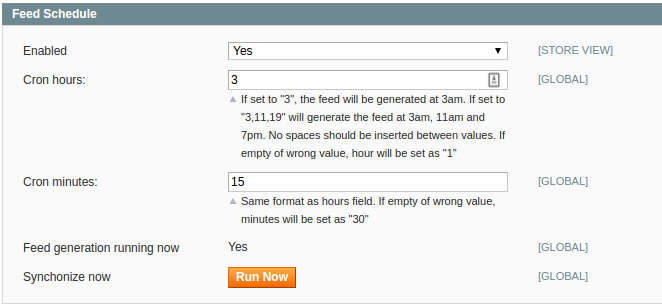
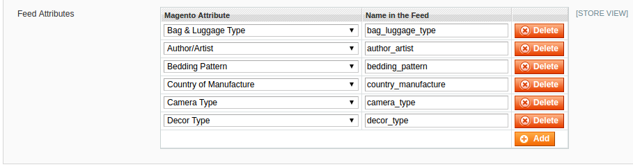
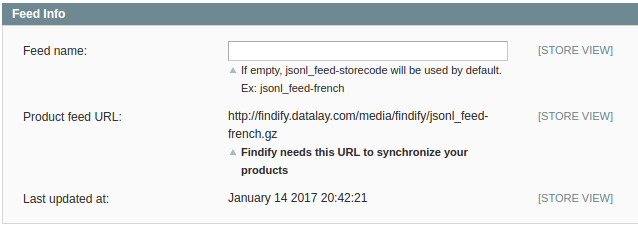

Findify for Magento
===================

The Findify extension allows you to generate a product feed containing all enabled products of your Magento store view.
For a multi-language or a multi-sites store, a distinct feed can be generated for each store view.

The main features of this extension are:
- Schedule the generation of the feeds
- Configure the attributes of the feeds

Magento compatible versions: 1.5, 1.6, 1.6.1, 1.6.2.0, 1.7, 1.8, 1.8.1, 1.9, 1.9.1, 1.9.2

## How to install the extension?

Unless you have enabled the Magento compiler, you will need to:

* Download the compressed [ZIP file](https://github.com/findify/findify-magento/archive/master.zip "ZIP") containing the extension from Github.
* Unzip it at the root of the Magento folder.
* Make sure that the webserver is allowed to write in the folder "/media/findify" so the extension can generate feeds there.
* Flush the Magento cache to reload the XML configuration files
* Log out and login again in the Magento admin panel.

No Magento core file is removed or rewritten.

If the Magento compiler is enabled, you will first need to disable it by navigating to "System > Tools > Compilation".
You can proceed then with the installation of the extension and re-enable then the compilation process.

## Extension configuration

Once the extension has been installed, you can access the Findify feed configuration by navigating to "System > Configuration".
On the left menu, click on "Findify Configuration".

## Feed Schedule

### Enable / Disable the feed generation
You can enable / disable the feed generation for each Magento view.
By default, the feed schedule is disabled for all of them.
Enabling the feed generation for a Magento view will, by default, use the website configuration. 

### Set the Cron schedule
You can specify the "hour" and "minutes" for generating the feed. By default, the feeds will be generated at 1:30am (also if the values are empty or incorrect).
For both fields, you have the possibility to define:
- a specific number. For instance hour = 3 and minutes = 45 if you want the feed to be generated at 3:45am.
- a range of numbers. For instance, hour = 3,11,19 and minutes = 15 if you want to generate the feed at 3:15am, 11:15am and 19:15am.

### Generate the feed now
In order to run the product feed generation now, click on the button "Run now".

## Feed Attributes
To add a new field to the feed you just need to:
- Choose the Magento attribute thanks to the drop-down on the left of the table.
- Assign a name to this attribute on the right. 

## Feed Information
Each view contains:
- A field to define the feed name. By default, a value is provided.
- The product feed URL that you will have to give to Findify.
- The last generation time of the feed.

